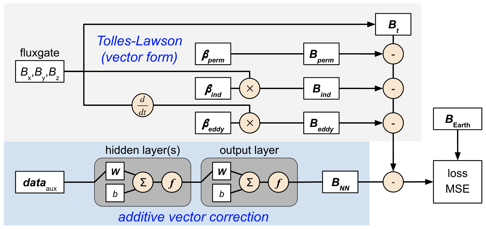

# NN-Based Model Diagrams

The goal of neural network-based aeromagnetic compensation is to use machine learning in order to create a nonlinear aeromagnetic compensation model. It may be possible to use additional sensors, beyond a single scalar and vector magnetometer, to improve compensation performance. Shown on this page are diagrams for each of the neural network-based aeromagnetic compensation models available within the package.

## Model 1

- `:m1` = standard NN

The approach taken here is to include additional data along with the typical magnetometer data. An example of possible data fields is provided in the Appendix of [Gnadt, 2022](https://magnav.mit.edu/publications). The idea here is that this additional data allows for greater observability of the aircraft magnetic field, and machine learning can learn the relationship between the data and aircraft field. A baseline model for this approach is to use a standard neural network to represent the compensation model in a pure data-driven approach, as shown above.

Here, the input data $\boldsymbol{data}_\mathrm{aux}$, also known as features, can be raw measurements and/or the Tolles-Lawson $\boldsymbol{A}$ matrix terms. Using the Tolles-Lawson terms is a form of scientific machine learning (SciML), as these terms represent prior scientific knowledge. This can potentially reduce the amount of data required for training. Note that during training, the mean squared error (MSE) of the aeromagnetic compensation output is compared with the output target. During testing (evaluation), the aeromagnetic compensation output just prior to the "loss MSE" in the figure is used for navigation.

## Model 2

### Model 2a

- `:m2a` = NN determines Tolles-Lawson coefficients

Model 1 can be extended into even more of a SciML approach using the physics of aeromagnetic compensation. Model 2a, shown above, more closely resembles the classical Tolles-Lawson model, now with 

$B_\mathrm{target} = \boldsymbol{A}~\boldsymbol{\beta}_\mathrm{NN}$

where $B_\mathrm{target}$ is some target magnetic value, $\boldsymbol{A}$ is the Tolles-Lawson $\boldsymbol{A}$ matrix, and $\boldsymbol{\beta}_\mathrm{NN}$ is a vector of varying coefficients.

Rather than directly determining some magnetic value, the output of the neural network is instead a set of varying coefficients. These are then multiplied by the Tolles-Lawson $\boldsymbol{A}$ matrix to produce a magnetic value. The general idea here is that this model is easier to train and more interpretable, since the coefficients have meaning related to the permanent, induced, and eddy-current terms in the Tolles-Lawson model. This model uses the same input data $\boldsymbol{data}_\mathrm{aux}$ as previously described, but also separately requires vector magnetometer measurements ($B_x$, $B_y$, $B_z$).

### Model 2b

- `:m2b` = NN determines additive correction to classical Tolles-Lawson

Another SciML approach that uses the physics of aeromagnetic compensation is model 2b, which is shown above. Rather than predicting the Tolles-Lawson coefficients with a neural network, the Tolles-Lawson coefficients for this approach are pre-determined, using any of the classical, modified, or map-based Tolles-Lawson models. Tolles-Lawson aeromagnetic compensation is then carried out, but large errors still remain for compensation of in-cabin magnetometers. An additive correction is then made to the Tolles-Lawson compensated value to further reduce the errors. This additive correction is the output of a neural network, similar to model 1, except now the neural network does not need to learn the Tolles-Lawson (linear) portion of the desired compensation and instead primarily learns the higher-order nonlinear portion.

### Model 2c

- `:m2c` = NN determines additive correction to classical Tolles-Lawson, Tolles-Lawson coefficients tuned as well

An immediate extension of model 2b is model 2c, which is shown above. These models look very similar, but there is one key, subtle difference. In model 2c, the Tolles-Lawson coefficients are updated by including them as parameters during training of the neural network, rather leaving them as static values. The Tolles-Lawson coefficients are not actually part of the neural network, but the Flux machine learning library and Julia programming language provide the flexibility to backpropagate the error to the Tolles-Lawson coefficients just as with the weights of the neural network.

### Model 2d

- `:m2d` = NN determines additive correction to each Tolles-Lawson coefficient

Model 2d combines the general idea behind models 2a and 2b. An additive correction is now made to each individual (static) Tolles-Lawson coefficient. This model was developed as it was thought that making the additive correction in a higher dimensional space may improve performance further.

## Model 3

- `:m3tl` = only fine-tuned Tolles-Lawson terms via SGD, without the Taylor expansion for Earth field targets
- `:m3s`  = scalar-corrected Tolles-Lawson with expanded vector terms for explainability
- `:m3v`  = vector-corrected Tolles-Lawson with expanded vector terms for explainability
- `:m3sc` = scalar-corrected Tolles-Lawson with curriculum learning
- `:m3vc` = vector-corrected Tolles-Lawson with curriculum learning

The various forms of model 3 use a NN to determine an additive correction to the expanded vector form of Tolles-Lawson. This is the newest model under development. More information forthcoming.
